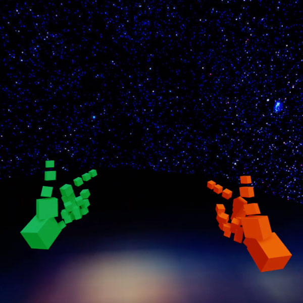

  

WebXR Hands
========================================================================
This study is part of my “Three.js in a Hurry” collection—an effort 
to help fellow spatial computing folks get up to speed quickly with 
the [Three.js](https://threejs.org/) WebGL-based 3D rendering library. 
This example contains a rotating 
[torus knot](https://en.wikipedia.org/wiki/Torus_knot) inside a 
[Cornell Box](https://en.wikipedia.org/wiki/Cornell_box) rendered live, 
complete with interactive controls for adjusting various parameters. 

The code is clean, commented, and contains links to relevant 
third-party documentation. This demonstration code is live at 
[http://stewartsmith.io/studies/vr-hands/](http://stewartsmith.io/studies/vr-hands/).

